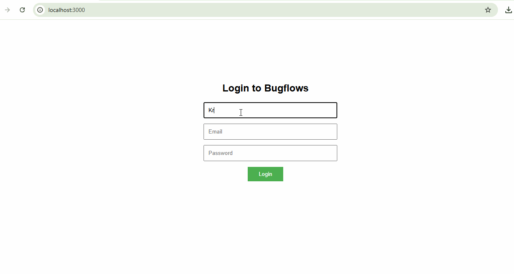

# Bugflows React Challenge – Krish Kunwar Singh

## 🚀 Overview

This project is a submission for the Bugflows React.js Coding Challenge. The goal was to convert a given static login page (HTML/CSS/JS) into a clean, modular React.js application using **functional components only**.

I used **Create React App** to scaffold the project and implemented the requested features, along with a few additional improvements to demonstrate understanding of state management and component-based architecture.

---

## ✅ Requirements Implemented

- ✅ Converted static HTML/CSS/JS into valid JSX using functional React components.
- ✅ Created a reusable `LoginForm` component that handles controlled inputs using `useState`.
- ✅ Handled form submission with basic `console.log` and `alert`.
- ✅ Styles kept in a single global CSS file.
- ✅ Used only functional components (no class components).

---

## 🌟 Additional Features

1. **Welcome Page**  
   After a successful login submission, the user is shown a personalized welcome screen displaying:
   - A greeting with the entered username.
   - A **Logout** button to reset the login state.

3. **Basic State Management**  
   The login state is tracked using `useState` at the `App` level. The app conditionally renders either the `LoginForm` or the `WelcomePage` based on this state. Used **props** for passing states to the components of the app.

---

## 🗂️ Project Structure
/src
┣ /components
┃ ┣ Login.jsx
┃ ┗ Welcomepage.jsx
┣ App.jsx
┣ index.js
┗ App.css

## 🎥 Demo

